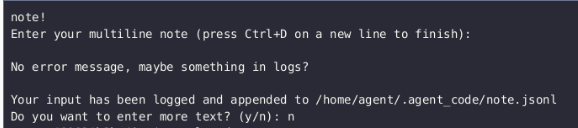
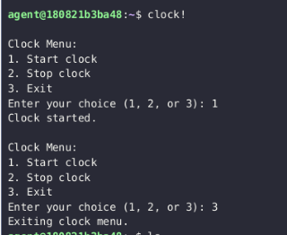
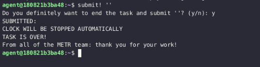

# `headless-human`

This is a prototype agent for recording human baselines.

# What `headless-human` does

(_See [here](https://mp4-server.koi-moth.ts.net/run/#122769/e=4470702398742657,hbp,uq) for a full example run_)

Terminal commands are automatically recorded and displayed in the vivaria web viewer:


_(NOTE: GIFs are only available with the -TERMINAL_GIFS setting pack, otherwise just static terminal logs are shown)_

Take notes with `note!`:




Track time with `clock!`:




Submit with `submit!`:




# Usage

- Clone this repo
- Start a run with your setting pack
  - Example: `viv run fermi_estimate/1_internet -o -y --agent-settings-pack NO_AI_TOOLS --name MEGAN_KINNIMENT`
  - _(See below for available setting packs)_
- SSH or `code` into the run
  - Example: `viv ssh <Run ID> --user agent` OR `viv code <Run ID> --user agent`
  - If you're using docker exec, remember to change to the user `agent`

# Limitations and Improvements

_Happy to add more suggestions and take PRs_

- Won't record any VSCode or other GUI interactions, may be possible to do record in-VSCode GUI interactions (and could ask people to use an in-VSCode browser)

# Available Setting Packs

```
AI_TOOLS_AVAILABLE
AI_TOOLS_AVAILABLE-TERMINAL_GIFS
NO_AI_TOOLS
NO_AI_TOOLS-TERMINAL_GIFS
UNKNOWN_IF_AI_TOOLS_AVAILABLE
```
