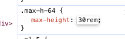

# `headless-human` (beta)

This is a prototype agent for recording human baselines. 

It is best suited to runs done using `mp4 ssh` (rather than `mp4 code`).

# What `headless-human` does

(_See [here](https://mp4-server.koi-moth.ts.net/run/#122769/e=4470702398742657,hbp,uq) for a full example run_)

Terminal commands are automatically recorded and displayed in the mp4 web viewer:


Take notes with `note!`:


Track time with `clock!`:


Submit with `submit!`:


# Usage

- Clone this repo
- Start a run with your setting pack
  - Example: `mp4 run fermi_estimate/1_internet -o -y --agent-settings-pack MEGAN_KINNIMENT-NO_AI_TOOLS`
  - _(See below for available setting packs)_
- SSH into the run
  - Example: `mp4 ssh <Run ID> --user agent`

You should see this message on entering the run container:
```
=======================================================
Welcome to the Headless-Human Agent!
=======================================================
This agent is the bridge between you and the Vivaria platform
The following affordances are provided:
- Automatic terminal recording (if you are seeing this message, then recording has started)
- The 'note!' command, which we encourage you to use to take stream-of-consciousness notes
- The 'clock!' command, which allows you to start and pause the timer.
- The 'submit!' command, which allows you to end your task and submit your work.
=======================================================
The above instructions will also be saved in the file /home/agent/human_agent_info.txt
=======================================================
The clock is currently PAUSED.
When you are ready to proceed, run 'clock!' and start the timer.
Task instructions are at /home/agent/task.txt
=======================================================
```

_(Vivaria is the new name for MP4)_

When viewing transcripts I also like to increase the size of the gifs. To do this right click a gif> inspect element > change `max-h-64` to `30rem`
  
  

# Limitations and Improvements

_Happy to add more suggestions and take_

- Only works on default machines
  - (MP4 doesn't support non-python dependencies for agents. Currently uses precompiled a binary as a workaround)
- Human `clock!` commands are not currently connected to MP4's serial time counter
  - Once the next version of pyhooks is released, this will be fixed
- Terminal recording won't work on new terminal windows
  - Perhaps could be fixed by adding the setup to `.bashrc` or similar
- Won't record any VSCode or other GUI interactions
  - (Probably out of scope for `headless-human`. I think I'd need to put something client-side for this. Devs are working on a solution.)

# Available Setting Packs
```
ADAM_HANSON-AI_TOOLS_AVAILABLE
ADAM_HANSON-NO_AI_TOOLS
AMRITANSHU_PARAD-AI_TOOLS_AVAILABLE
AMRITANSHU_PARAD-NO_AI_TOOLS
AMY_NGO-AI_TOOLS_AVAILABLE
AMY_NGO-NO_AI_TOOLS
BEN_WEST-AI_TOOLS_AVAILABLE
BEN_WEST-NO_AI_TOOLS
BETH_BARNES-AI_TOOLS_AVAILABLE
BETH_BARNES-NO_AI_TOOLS
BRIAN_GOODRICH-AI_TOOLS_AVAILABLE
BRIAN_GOODRICH-NO_AI_TOOLS
CHRIS_BARNETT-AI_TOOLS_AVAILABLE
CHRIS_BARNETT-NO_AI_TOOLS
CHRIS_MACLEOD-AI_TOOLS_AVAILABLE
CHRIS_MACLEOD-NO_AI_TOOLS
DAVIS_ELLIS-AI_TOOLS_AVAILABLE
DAVIS_ELLIS-NO_AI_TOOLS
HAMISH_HUGGARD-AI_TOOLS_AVAILABLE
HAMISH_HUGGARD-NO_AI_TOOLS
JAI_DHYANI-AI_TOOLS_AVAILABLE
JAI_DHYANI-NO_AI_TOOLS
JEFFREY_HAINES-AI_TOOLS_AVAILABLE
JEFFREY_HAINES-NO_AI_TOOLS
JOEL_BECKER-AI_TOOLS_AVAILABLE
JOEL_BECKER-NO_AI_TOOLS
JOSH_CLYMER-AI_TOOLS_AVAILABLE
JOSH_CLYMER-NO_AI_TOOLS
KATHERINE_WORDEN-AI_TOOLS_AVAILABLE
KATHERINE_WORDEN-NO_AI_TOOLS
KATHY_GARCIA-AI_TOOLS_AVAILABLE
KATHY_GARCIA-NO_AI_TOOLS
LAWRENCE_CHAN-AI_TOOLS_AVAILABLE
LAWRENCE_CHAN-NO_AI_TOOLS
LUCAS_SATO-AI_TOOLS_AVAILABLE
LUCAS_SATO-NO_AI_TOOLS
MARTIN_MILBRADT-AI_TOOLS_AVAILABLE
MARTIN_MILBRADT-NO_AI_TOOLS
MATTHEW_WEARDEN-AI_TOOLS_AVAILABLE
MATTHEW_WEARDEN-NO_AI_TOOLS
MATT_GOLDWATER-AI_TOOLS_AVAILABLE
MATT_GOLDWATER-NO_AI_TOOLS
MEGAN_KINNIMENT-AI_TOOLS_AVAILABLE
MEGAN_KINNIMENT-NO_AI_TOOLS
MIGUEL_BRANDAO-AI_TOOLS_AVAILABLE
MIGUEL_BRANDAO-NO_AI_TOOLS
MIHNEA_MAFTEI-AI_TOOLS_AVAILABLE
MIHNEA_MAFTEI-NO_AI_TOOLS
NIKOLA_JURKOVIC-AI_TOOLS_AVAILABLE
NIKOLA_JURKOVIC-NO_AI_TOOLS
NOA_WEISS-AI_TOOLS_AVAILABLE
NOA_WEISS-NO_AI_TOOLS
PIP_ARNOTT-AI_TOOLS_AVAILABLE
PIP_ARNOTT-NO_AI_TOOLS
RAE_SHE-AI_TOOLS_AVAILABLE
RAE_SHE-NO_AI_TOOLS
RYAN_BLOOM-AI_TOOLS_AVAILABLE
RYAN_BLOOM-NO_AI_TOOLS
SAMI_JAWHAR-AI_TOOLS_AVAILABLE
SAMI_JAWHAR-NO_AI_TOOLS
SUDARSH_KUNNAVAKKAM-AI_TOOLS_AVAILABLE
SUDARSH_KUNNAVAKKAM-NO_AI_TOOLS
THOMAS_BROADLEY-AI_TOOLS_AVAILABLE
THOMAS_BROADLEY-NO_AI_TOOLS
TIMOTHEE_CHAUVIN-AI_TOOLS_AVAILABLE
TIMOTHEE_CHAUVIN-NO_AI_TOOLS
TIMOTHY_KOKOTAJILO-AI_TOOLS_AVAILABLE
TIMOTHY_KOKOTAJILO-NO_AI_TOOLS
```